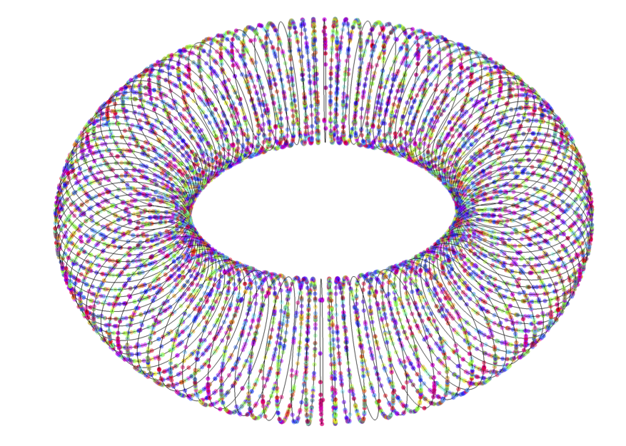
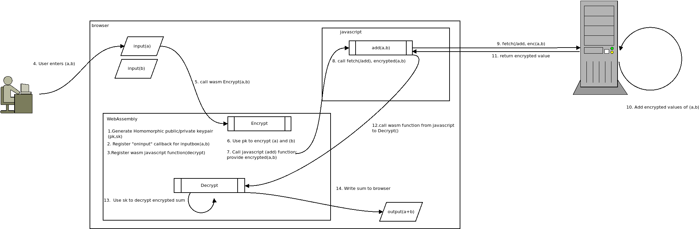

## A simple soroban using WebAssembly and Homomorphic Encryption

About a year ago i was reading up on the new hotness that is [homomorphic encryption](https://en.wikipedia.org/wiki/Homomorphic_encryption) and tried to understand what it is and how it works.   I guess i know the former just barely but the latter simply is way, way beyond my  skills.  If thats' what your'e looking to find here, please see the articles cited below (esp [A Homomorphic Encryption Illustrated Primer](https://muens.io/pdfs/stephen-hardy-a-homomorphic-encryption-illustrated-primer.pdf) ).

Anyway, in an effort to learn it, i decided to writeup a simple "ride sharing" app that i read about in both [Microsoft SEAL](https://github.com/microsoft/SEAL) and go's [Lttigo](https://github.com/ldsec/lattigo) libraries.  It worked pretty nicely if for nothing else but a 'helloworld'.

Today, wanted to learn a bit about _browser_ webassembly.  I had done some prior work in `Envoy proxy-wasm` and thought...why cant use a browser to do homomorphic encryption?

The general idea is that your browser would create or store the homomorphic keys but delegate to a remote server to do the 'heavy lifting' operations for FHE like add, multiply, divide, etc.  Basically, your browser is just encrypting/decrypting data but a remote server is doing the actual work `without even knowing anything about the data`....yeah, the last bit is just like magic to me...

So the original idea i had about a fun demo would've been to create a simple US Department of Taxation "1040EZ" form...the app i had in mind i'd fill in many of the values for my taxes, the wasm would encrypt them...then transmit each cell sequentially to a server ...the server would do the rest and send me back how much i'd invariably owe the man.

long story short, i got lazy,real lazy....i changed the app to be just simple adding machine...a [Soroban](https://en.wikipedia.org/wiki/Soroban) that just adds...

(if nothing else, look at the nice picture, thats taken from the excellent article cited)



---

### References

`FHE`

- [A Homomorphic Encryption Illustrated Primer](https://muens.io/pdfs/stephen-hardy-a-homomorphic-encryption-illustrated-primer.pdf)
- [Microsoft SEAL](https://github.com/microsoft/SEAL)
- [SEAL Manual](https://www.microsoft.com/en-us/research/uploads/prod/2017/11/sealmanual-2-3-1.pdf)
- [SEAL Demo](https://github.com/microsoft/SEAL-Demo)
- [Lttigo](https://github.com/ldsec/lattigo)

`WASM`

- [Envoy WASM and LUA filters for Certificate Bound Tokens](https://github.com/salrashid123/envoy_cert_bound_token)
- [Envoy WASM with external gRPC server](https://github.com/salrashid123/envoy_wasm)
- [SEAL: Example of Multi-Key encryption](https://github.com/microsoft/SEAL/issues/206)

---

### Architecture

So in this tutorial, we will create a wasm binary in go that itself loads up the lattigo library for FHE operations.  We will interact with the browsers' javascript obects and also use `fetch` to send the encrypted data to a remote server that will just add `a+b`...but under encryption without even knowing what `a` and `b` are...




### Setup

To use this demo, we will need `go 1.17`...really, thats it.


First compile the wasm binary
```bash
# copy your own `wasm_exec.js` if you want...or just use the one in this repo
# cp $GOROOT/misc/wasm/wasm_exec.js html/wasm_exec.js
### wget https://raw.githubusercontent.com/golang/go/refs/tags/go1.21.0/misc/wasm/wasm_exec.js

# compile
GOOS=js GOARCH=wasm go build -o  server/static/wasm/main.wasm  main.go
```

### Run Server

Run the backend server:

```bash
cd server
go run server.go
```

### do Math

Open up a browser and goto

```
http://localhost:8080/static/
```

On startup, a brand new public and private FHE keys are created but persist for the duration of this instance of wasm.

Change the value of `a` or `b` in the  input boxes.

What you'll see a callback from javascript to wasm to encrypt the fields.  The hash of the encrypted values are shown in the browser (i woud've shown the full polynomial representation of the encrypted values but its....long (and i'm lazy)).

once the values are filled in, wasm will call a function in javascript to `fetch()` an external URL (wasm can't make http calls on its own from a browser...it needs to ask javascript).

The fetch call contacts the server and provides the encrypted values of `a` and `b`.   

The server simply adds the number and responds back..again, to emphasize, without even knowing what those values are...it addd them nonetheless...

The browser will callback wasm, provide the encrypted value and wasm will then use its secret FHE key to decrypt the data and render the sum...

---

thats about it...someday i'll begin to learn the math..


